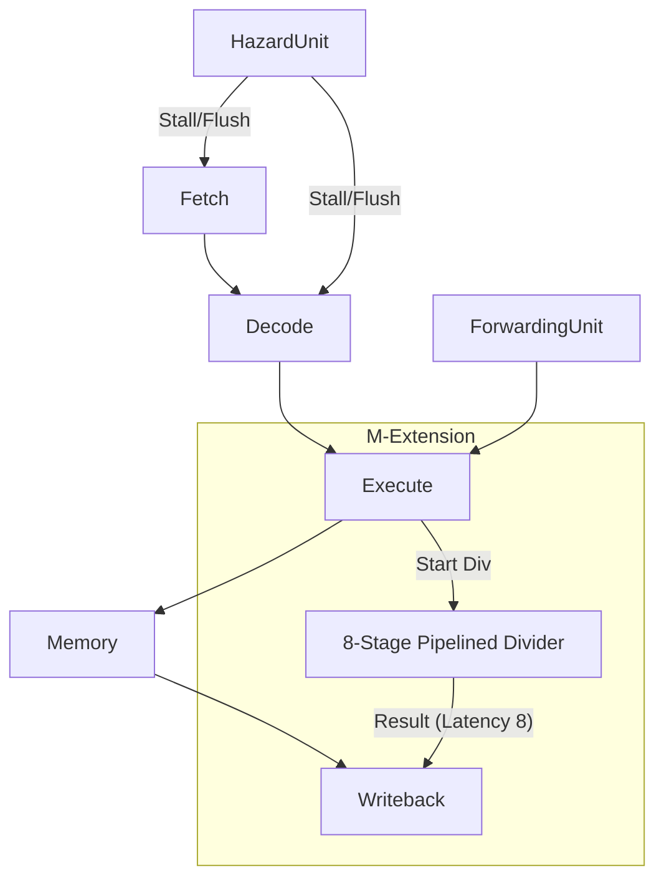

Based on the code provided, here is a comprehensive `README.md` file written in English. It covers the architecture, file structure, and technical details of your RV32IM Pipelined Processor project.

---

# RV32IM Pipelined Processor

This repository contains a Verilog implementation of a 32-bit RISC-V processor (RV32IM). The design features a classic 5-stage pipeline extended with a complex multi-cycle hardware divider and a fast Carry Lookahead Adder. The processor handles data hazards via forwarding and control hazards via flushing, supporting the **M-Extension** (Multiplication and Division).

## 📂 Project Structure

| File Name | Description |
| --- | --- |
| **`DatapathPipelined.v`** | The core module. It contains the 5-stage pipeline logic (Fetch, Decode, Execute, Memory, Writeback), Hazard Detection Unit, Forwarding Unit, Register File, and the top-level `Processor` module. |
| **`DividerUnsignedPipelined.v`** | An 8-stage pipelined hardware divider. It performs 32-bit division using a shift-subtract algorithm (4 iterations per stage). |
| **`cla.v`** | A 32-bit Carry Lookahead Adder (CLA). Used by the ALU for high-speed addition and subtraction. |
| **`mem_initial_contents.hex`** | Hexadecimal machine code used to initialize the Instruction Memory for simulation/testing. |

## 🚀 Key Features

### 1. 5-Stage Pipeline Architecture

The processor implements the standard RISC-V stages:

* **IF (Instruction Fetch):** Fetches instructions from memory.
* **ID (Instruction Decode):** Decodes opcodes, reads Register File, and generates control signals.
* **EX (Execute):** Performs ALU operations and calculates branch targets.
* **MEM (Memory):** Accesses Data Memory for Load/Store operations.
* **WB (Writeback):** Writes results back to the Register File.

### 2. RV32M Extension (Multiplication & Division)

* **Multiplication (`MUL`, `MULH`, etc.):** Handled within the Execute stage.
* **Division (`DIV`, `REM`, etc.):**
* Utilizes a dedicated **8-stage Pipelined Divider** defined in `DividerUnsignedPipelined.v`.
* Supports Signed and Unsigned division.
* Includes a **Shadow Pipeline** in the Datapath to track divider instructions as they propagate, preventing structural hazards at the Writeback stage.

### 3. Advanced Hazard Handling

* **Data Hazards:** Solved using a **Forwarding Unit** that bypasses data from MEM or WB stages directly to the EX stage (ALU inputs).
* **Load-Use Hazards:** Detects dependencies on a Load instruction and inserts a stall (bubble).
* **Structural Hazards (Divider):** Logic is implemented to stall the pipeline if a division result clashes with a standard instruction writeback, or if division operands are not ready.
* **Control Hazards:** Flushes the Fetch/Decode pipeline registers upon taking a Branch or Jump.

### 4. High-Performance Arithmetic

* **CLA (Carry Lookahead Adder):** Replaces the standard ripple-carry adder in the ALU to reduce critical path delay during arithmetic operations.

## 🛠 Instruction Set Support (RV32IM)

The processor supports the following opcode groups:

* **Arithmetic/Logic:** `ADD`, `SUB`, `AND`, `OR`, `XOR`, `SLL`, `SRL`, `SRA`, `SLT`, `SLTU`.
* **Immediate:** `ADDI`, `ANDI`, `ORI`, `XORI`, `SLLI`, `SRLI`, `SRAI`, `SLTI`, `SLTIU`.
* **Control Flow:** `BEQ`, `BNE`, `BLT`, `BGE`, `BLTU`, `BGEU`, `JAL`, `JALR`.
* **Memory:** `LW`, `LB`, `LH`, `LBU`, `LHU`, `SW`, `SB`, `SH`.
* **Upper Immediate:** `LUI`, `AUIPC`.
* **M-Extension:** `MUL`, `MULH`, `MULHSU`, `MULHU`, `DIV`, `DIVU`, `REM`, `REMU`.
* **System:** `ECALL` (mapped to `OpcodeEnviron` for halting simulation).

## 📐 Architecture Diagram (Text Concept)

---

*This project demonstrates a complex digital design integrating standard pipelining with multi-cycle arithmetic units and rigorous hazard mitigation logic.*