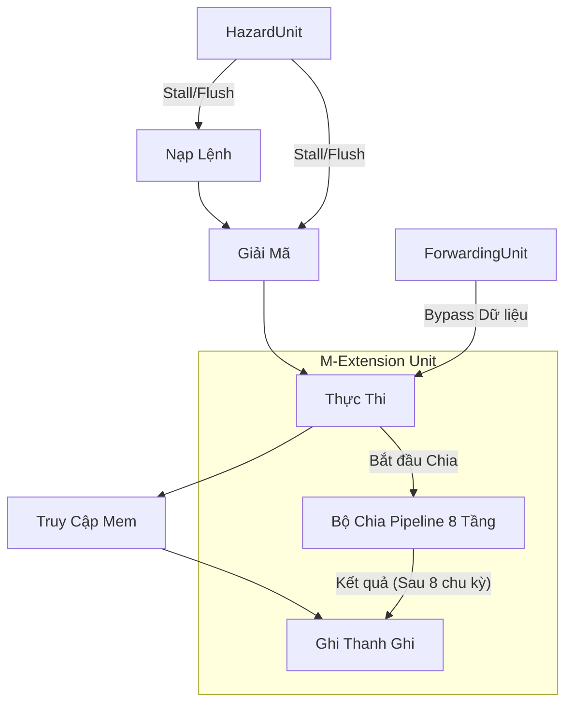

Dưới đây là phiên bản `README.md` bằng tiếng Việt, được viết chi tiết và chuyên nghiệp, phù hợp để trình bày trong đồ án môn học hoặc Portfolio cá nhân trên GitHub.

---

# Bộ Xử Lý RV32IM Pipelined (RV32IM Pipelined Processor)

Dự án này là mã nguồn Verilog mô tả một bộ vi xử lý **RISC-V 32-bit (RV32IM)**. Thiết kế sử dụng kiến trúc **Pipeline 5 tầng (5-stage pipeline)** cổ điển, tích hợp bộ nhân/chia phần cứng (M-Extension) và các kỹ thuật xử lý xung đột (Hazard Handling) tiên tiến.

## 📂 Cấu trúc Dự án

Bảng dưới đây mô tả chức năng của các file mã nguồn chính:

| Tên File | Mô tả |
| --- | --- |
|  **`DatapathPipelined.v`** |  Module trung tâm chứa toàn bộ Datapath và Control Logic. Bao gồm 5 tầng pipeline (Fetch, Decode, Execute, Memory, Writeback), bộ thanh ghi (Register File), và các đơn vị phát hiện xung đột/forwarding.

 |
|  **`DividerUnsignedPipelined.v`** |  Bộ chia phần cứng 8 tầng (8-stage pipeline). Thực hiện phép chia số nguyên 32-bit sử dụng thuật toán dịch-trừ với hiệu năng cao.

 |
|  **`cla.v`** |  Bộ cộng nhìn trước số nhớ (Carry Lookahead Adder - CLA) 32-bit. Được sử dụng trong tầng Execute để tăng tốc độ tính toán số học so với bộ cộng Ripple-Carry thông thường.

 |
|  **`mem_initial_contents.hex`** |  File chứa mã máy (machine code) dưới dạng thập lục phân để khởi tạo bộ nhớ Instruction Memory phục vụ mô phỏng.

 |

## 🚀 Các Tính Năng Nổi Bật

### 1. Kiến trúc Pipeline 5 Tầng

Bộ xử lý thực hiện đầy đủ 5 giai đoạn chuẩn của RISC-V:

* 
**IF (Instruction Fetch):** Lấy lệnh từ bộ nhớ.

* 
**ID (Instruction Decode):** Giải mã lệnh và đọc thanh ghi.

* 
**EX (Execute):** Thực thi phép tính ALU hoặc tính địa chỉ rẽ nhánh.

* 
**MEM (Memory):** Truy cập bộ nhớ dữ liệu (Load/Store).

* 
**WB (Writeback):** Ghi kết quả ngược lại vào thanh ghi.

### 2. Hỗ trợ M-Extension (Nhân & Chia)

* 
**Phép Nhân (`MUL`):** Xử lý trực tiếp tại tầng Execute.

* **Phép Chia (`DIV/REM`):**
* Sử dụng module **Divider 8 tầng pipeline** riêng biệt.

* Hỗ trợ chia có dấu và không dấu (xử lý đảo dấu đầu vào/đầu ra).

* Có cơ chế **Shadow Pipeline** trong Datapath để theo dõi lệnh chia đang chạy và xử lý xung đột khi ghi kết quả (Writeback).

### 3. Cơ chế Xử lý Hazard (Xung đột)

Hệ thống tự động phát hiện và xử lý các loại xung đột để đảm bảo tính đúng đắn của chương trình:

* 
**Data Hazard:** Sử dụng **Forwarding Unit** (Bypass) để chuyển dữ liệu từ tầng MEM hoặc WB trực tiếp xuống tầng EX mà không cần đợi ghi vào thanh ghi .

* 
**Load-Use Hazard:** Tự động phát hiện sự phụ thuộc vào lệnh Load phía trước và chèn khoảng nghỉ (Stall).

* 
**Structural Hazard (Divider):** Logic kiểm soát đặc biệt để ngăn xung đột khi bộ chia và pipeline chính cùng muốn ghi vào Register File tại một thời điểm.

* 
**Control Hazard:** Tự động xóa (Flush) các lệnh sai trong đường ống khi gặp lệnh rẽ nhánh (Branch/Jump).

### 4. Tối ưu hóa Số học

* 
**CLA Adder:** Sử dụng kiến trúc cây `gp1` -> `gp4` -> `gp8` để giảm thiểu độ trễ lan truyền bit nhớ (carry propagation delay) trong các phép cộng trừ.

## 🛠 Tập Lệnh Hỗ Trợ (ISA Support)

Bộ xử lý hỗ trợ tập lệnh RV32IM cơ bản:

* **Số học/Logic:** `ADD`, `SUB`, `AND`, `OR`, `XOR`, `SLL`, `SRL`, `SRA`, `SLT`, `SLTU`.
* **Tức thời (Immediate):** `ADDI`, `ANDI`, `ORI`, `XORI`, `SLLI`, `SRLI`, `SRAI`, `SLTI`, `SLTIU`.
* **Điều khiển dòng lệnh:** `BEQ`, `BNE`, `BLT`, `BGE`, `BLTU`, `BGEU`, `JAL`, `JALR`.
* **Truy cập bộ nhớ:** `LW`, `LB`, `LH`, `LBU`, `LHU`, `SW`, `SB`, `SH`.
* **Xử lý thanh ghi PC:** `LUI`, `AUIPC`.
* **M-Extension:** `MUL`, `MULH`, `MULHSU`, `MULHU`, `DIV`, `DIVU`, `REM`, `REMU`.
* 
**System:** `ECALL` (Mô phỏng dừng chương trình qua opcode `OpcodeEnviron`).

## 📐 Sơ đồ Khối (Minh họa)

---

*Dự án này minh họa một thiết kế kỹ thuật số phức tạp, kết hợp giữa kiến trúc đường ống tiêu chuẩn với các đơn vị số học đa chu kỳ và logic xử lý xung đột chặt chẽ.*